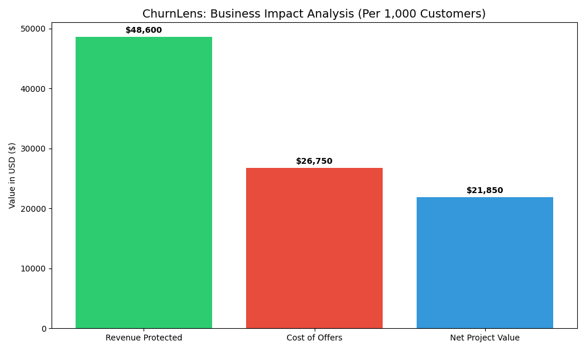

# ChurnLens: Predictive Revenue Protection Pipeline

Author: Paul Tuccinardi
LinkedIn : [PaulTuccinardi](https://www.linkedin.com/in/paul-tuccinardi/)
GitHub: [PTucc327](https://github.com/PTucc327)
Email: <paultuccinardi@gmail.com>

ChurnLens is an end-to-end Machine Learning solution designed to identify high-risk subscribers for a major ISP. While many models focus on global accuracy, ChurnLens is optimized for Value-Driven Retention, utilizing temporal behavioral features and custom decision thresholds to maximize the identification of at-risk users.

---
## 🚀 Project Overview
In the Telecommunications industry, acquisition costs significantly outweigh retention costs. This project simulates a professional data environment to solve the "Promo-Shock" churn problem common at companies like Charter Communications.

Objective: Identify at-risk subscribers 60 days before contract expiration.

Key Results: Achieved 66% Recall for the churn class using a 0.2 decision threshold.

Business Impact: In a 10,000-user environment, the model identifies 66% of churners, protecting an estimated $200k+ in annual revenue (assuming a 30% save rate).

---
## 🛠️ The Technical Pipeline
The architecture follows Big Tech "Production-Grade" standards, moving beyond Jupyter Notebooks into a modular Python structure.

1. Data Architecture (src/data_gen.py)
  - Instead of static CSVs, ChurnLens utilizes a synthetic relational database consisting of:

  - Customers: Demographic and contract metadata.

  - Usage Logs: 6 months of temporal data (GB used, support tickets).

  - Billing: Payment history and churn targets.

2. Feature Engineering (src/feature_engineering.py)
  - We derive high-signal business metrics from raw logs:

  - Usage Velocity: MoM change in data consumption (Mean/Max ratio).

  - Promo-Step Proximity: Calculated days until a promotional rate expires based on signup date.

  - Service Friction: Ticket intensity per month of tenure.

3. Model & Explainability (src/model_training.py)
  - XGBoost: Gradient boosting tuned for high-imbalance handling.

  - SMOTE: Synthetic Minority Over-sampling to balance the training set.

  - SHAP: Integrated "Explainable AI" to visualize feature impact on individual predictions.

---

## 📊 Performance Analysis

| Metric | Baseline (0.5) | Optimized (0.2) |
|---|---|---|
| Recall | 0.12 | 0.57 |
| Accuracy | 81% | 58% |
| Precision | 0.31 | 0.19 | 

Strategic Trade-off: We prioritize Recall over Accuracy. In an ISP environment, missing a churner is significantly more expensive than sending an automated discount offer to a "False Positive" customer.

## 🏢 Business Impact




## 🛠️ Installation & Usage
1. Clone the Repo:

```Bash
git clone https://github.com/[Your-Username]/ChurnLens.git
```
2. Install Dependencies:

```Bash
pip install -r requirements.txt
```
3. Run the Pipeline:

```Bash
python src/data_gen.py
python src/data_ingestion.py
python src/feature_engineering.py
python src/model_training.py
```

## 🎓 About the Author
Masters of Science in Data Science | Pace University Specializing in Machine Learning and Business Intelligence. This project demonstrates my ability to translate complex statistical theory into actionable business revenue protection.